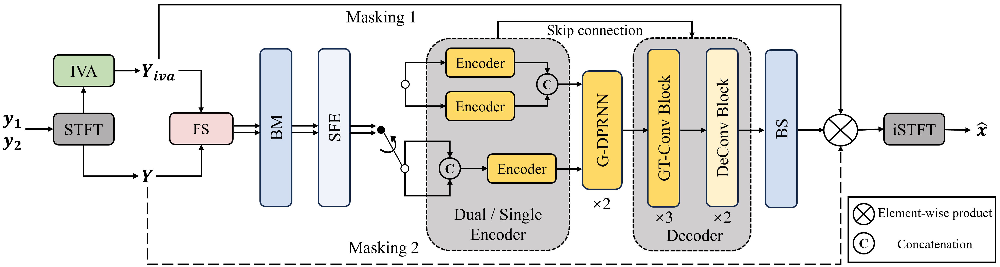

# H-GTCRN

This repository is the official implementation of the Interspeech2025 paper: A Lightweight Hybrid Dual Channel Speech Enhancement System under Low-SNR Conditions. For more details, please refer to the [ISCA Archive](https://www.isca-archive.org/interspeech_2025/wang25h_interspeech.html).


|  |
| ------------------------------------------------------------- |
| **Figure 1:** The framework of our proposed system.           |


## 🔥 News

- [**2026-9-18**] Released **masking on IVA** and **masking on noisy** as two named variants (with separate checkpoints). Clarified that Figure 2 and Table 1 in the paper swap the *Masking 1* / *Masking 2* labels; use the folder names in this repo instead.
- [**2026-3-13**] The model implementation and pre-trained checkpoint are released.
- [**2025-8-17**] The paper is uploaded to [ISCA Archive](https://www.isca-archive.org/interspeech_2025/wang25h_interspeech.html).
- [**2025-5-25**] The paper is uploaded to arxiv .


## Masking variants

Do **not** rely on the paper labels *Masking 1* / *Masking 2* when choosing a checkpoint. In the camera-ready PDF, **Figure 2** and the **Table 1 ablation** use those names in opposite ways. This repo names the two systems by what the complex ratio mask (CRM) is multiplied with:


| Folder                                    | CRM applied to                 | Checkpoint                                                      |
| ----------------------------------------- | ------------------------------ | --------------------------------------------------------------- |
| `[masking_on_noisy/](./masking_on_noisy)` | original noisy mixture (mic 0) | `[best_model_0121.tar](./masking_on_noisy/best_model_0121.tar)` |
| `[masking_on_iva/](./masking_on_iva)`     | energy-selected AuxIVA speech  | `[best_model_0110.tar](./masking_on_iva/best_model_0110.tar)`   |


Both use the same GTCRN backbone, the same **IVA-S&N + LPS** features (noisy RI concatenated with log-magnitude of IVA speech and IVA noise), and the same front-end: FD-WPE (`rt60=0.3`, `num_iter=1`) then AuxIVA with `n_iter=20`.

**How they behave**

- **Masking on IVA** tends to score higher on the paper’s simulated test protocol when AuxIVA separation is reliable, because the mask refines an already separated speech channel. It is more sensitive to IVA errors (permutation, leakage, residual reverberation).
- **Masking on noisy** is more stable when IVA is imperfect: the network still has the raw mixture as the mask target. That is the checkpoint we shipped first.

Please choose the variant that best fits your experimental needs.

Default `infer.py --variant noisy` keeps the old public behavior. Use `--variant iva` for the IVA-masking weights.

## Inference

To run inference on audio files, use:

```bash
# masking on noisy (previous GitHub default)
python infer.py --variant noisy --input_dir <input_dir> --output_dir <output_dir> --device <device>

# masking on IVA
python infer.py --variant iva --input_dir <input_dir> --output_dir <output_dir> --device <device>
```

Optional flags: `--checkpoint <path>` `--suffix <suffix>`. Defaults are `./masking_on_noisy/best_model_0121.tar` and `./masking_on_iva/best_model_0110.tar`.

## Audio samples

The directory structure of the audio samples is shown below.

```markdown
    samples
    ├── Samples1
    |   ├── Samples1_clean.wav
    |   ├── Samples1_noisy.wav
    |   ├── Samples1_IVA.wav
    |   ├── Samples1_GTCRN.wav
    |   ├── Samples1_DC_GTCRN.wav
    |   └── Samples1_Proposed.wav
    | ...
    └── Samples3
        ├── Samples3_clean.wav
        ├── Samples3_noisy.wav
        ├── Samples3_IVA.wav
        ├── Samples3_GTCRN.wav
        ├── Samples3_DC_GTCRN.wav
        └── Samples3_Proposed.wav
```


## Citation

If you find this work useful, please cite our paper:

```bibtex
@inproceedings{wang2025lightweight,
  title={A Lightweight Hybrid Dual Channel Speech Enhancement System under Low-SNR Conditions},
  author={Wang, Zheng and Rong, Xiaobin and Sun, Yu and Sun, Tianchi and Lin, Zhibin and Lu, Jing},
  booktitle={Proc. Interspeech 2025},
  pages={1178--1182},
  year={2025}
}
```


## Credits

We gratefully acknowledge the following resources that made this project possible:

- [GTCRN](https://github.com/Xiaobin-Rong/gtcrn): SOTA lightweight speech enhancement model architecture.
- [SE-train](https://github.com/Xiaobin-Rong/SEtrain): Excellent training code template for DNN-based speech enhancement.
- [pyroomacoustics](https://github.com/LCAV/pyroomacoustics)

